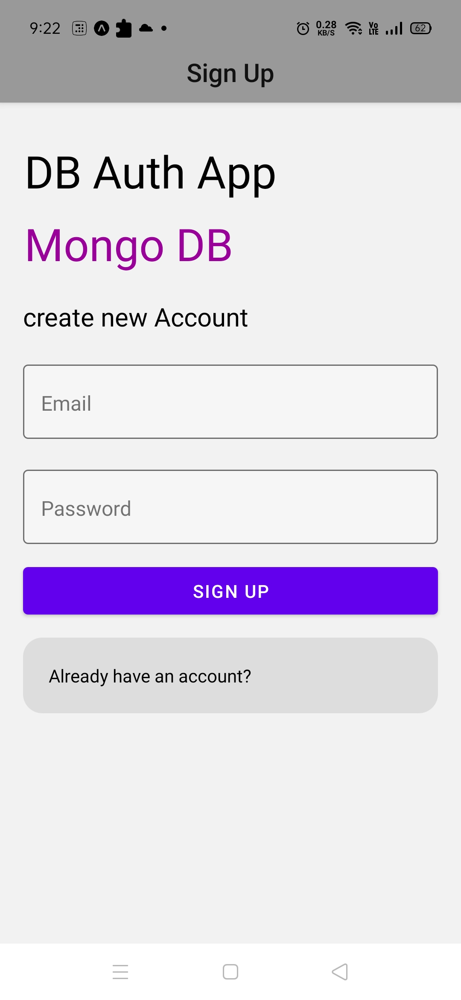
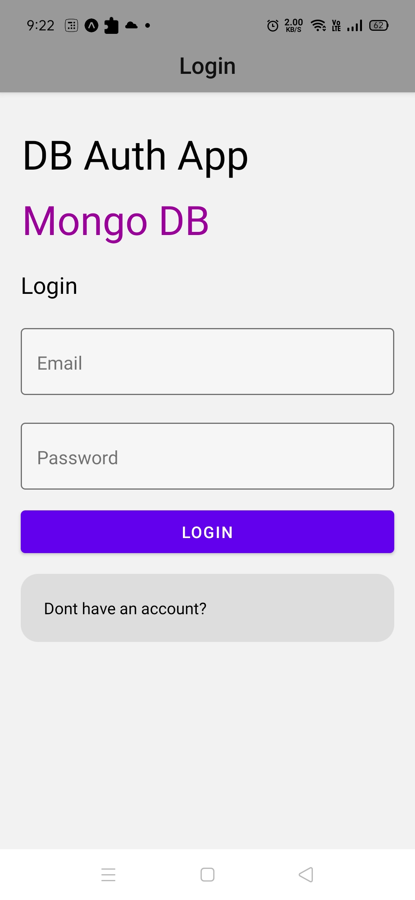
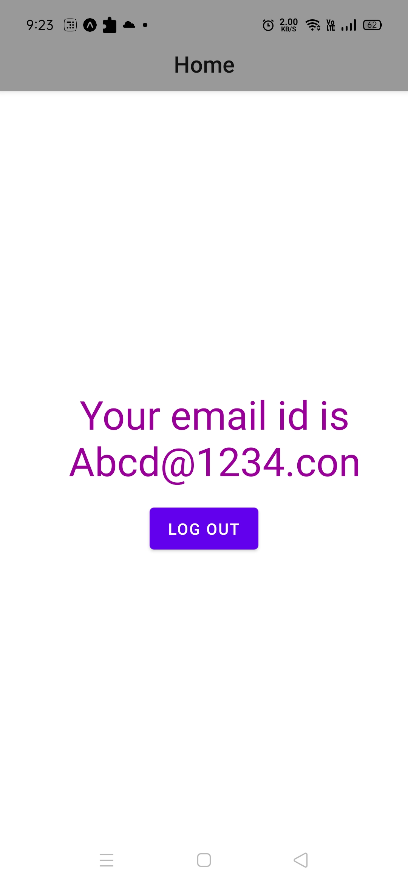

# MongoDB-Authentication

## Table of contents
* [General info](#general-info)
* [Technology](#technology)
* [Packages](#packages)
* [Features](#features)

## General info
This directory contains the Mobile App of the Project. It is developed using React-Native. [Expo](https://expo.io/) is used to build the project.

## Technology
Project is created with:
* React-Native

## Packages
* [React Navigation v5](https://reactnavigation.org/)
* [React Native Paper](https://www.npmjs.com/package/react-native-paper)

## Features
* Sign Up

* Login

* Home

